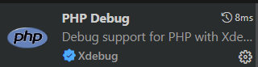
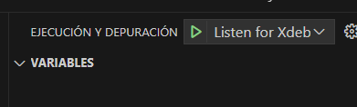

 
- [Arquitectura del entorno de desarrollo](#arquitectura-del-entorno-de-desarrollo)
- [Operaciones comunes](#operaciones-comunes)
  - [Ejecutar el entorno](#ejecutar-el-entorno)
  - [Borrar la base de datos](#borrar-la-base-de-datos)
  - [Ejecutar migraciones y seeders](#ejecutar-migraciones-y-seeders)
  - [Ejecutar el debugger](#ejecutar-el-debugger)
- [Referencias](#referencias)


# Arquitectura del entorno de desarrollo


- [Ver diagrama fuente](stepbystep/daigrama3x.png)
- [Ver la explicación detallada de todos los ficheros de configuración para más detalle](stepbystep/guide.md)

# Operaciones comunes

## Ejecutar el entorno

```bash
docker compose up -d --build
``` 

En muchos casos, cuando el build se ha estabilizado, no necesitamos utilizar el parámetro `--build` por lo que podemos omitir este paso,
## Borrar la base de datos

1. Podemos relanzar todo el entorno entero, si no hemos asociado ningún volumen con la base de datos.
2. Podemos borrar el volumen de la base de datos de haberlo

## Ejecutar migraciones y seeders

Si queremos que se ejecuten las migraciones y seeders basta con eliminar el archivo **.env** del entorno, este se generará a partir del **.env.example** en el script de `entrypoint.sh`, considerandose una nueva instalación.

## Ejecutar el debugger

Instalar la extension Xdebug, y ejecutar, debería pararse en los breakpoints de php.




ver [Explicación detallada de todos los ficheros de configuración](stepbystep/guide.md) para más detalle sobre la configuración del debugger.

# Referencias

- [Explicación detallada de todos los ficheros de configuración](stepbystep/guide.md)
- [Intertia PingCRM](https://github.com/inertiajs/pingcrm)
- [laravel-alpine-nginx-phpfpm-opcache-docker](https://github.com/jdsantos/laravel-alpine-nginx-phpfpm-opcache-docker)
  

| <a href="http://mikeldalmau.com" target="_blank">**Mikel Dalmau**</a>
|:---:|
| [](http://mikeldalmau.com)    | 
| <a href="https://github.com/mikeldalmauc" target="_blank">`github.com/mikeldalmauc`</a>

