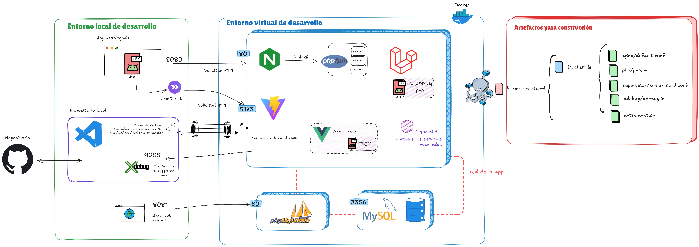
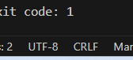
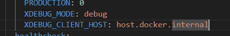
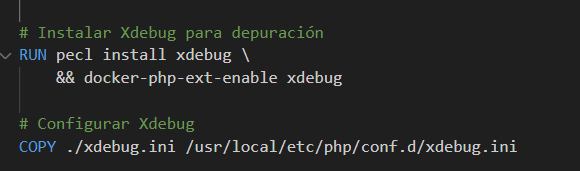

- [Arquitectura del entorno de desarrollo](#arquitectura-del-entorno-de-desarrollo)
- [Detalle de las configuraciones](#detalle-de-las-configuraciones)
  - [Configuración del `docker-compose.yml`](#configuración-del-docker-composeyml)
    - [Descripción General](#descripción-general)
    - [Servicio `laravel`](#servicio-laravel)
      - [Componentes Detallados](#componentes-detallados)
    - [Servicio `mysql`](#servicio-mysql)
      - [Componentes Detallados](#componentes-detallados-1)
    - [Servicio `phpmyadmin`](#servicio-phpmyadmin)
      - [Componentes Detallados](#componentes-detallados-2)
    - [Volúmenes y Redes](#volúmenes-y-redes)
      - [Volúmenes](#volúmenes)
      - [Redes](#redes)
    - [Resumen General](#resumen-general)
  - [Configuración del Dockerfile](#configuración-del-dockerfile)
    - [Imagen Base](#imagen-base)
    - [Directorio de Trabajo](#directorio-de-trabajo)
    - [Instalación de Paquetes Adicionales](#instalación-de-paquetes-adicionales)
    - [Instalación y Configuración de Xdebug](#instalación-y-configuración-de-xdebug)
    - [Instalación de Composer](#instalación-de-composer)
    - [Configuración de Nginx, PHP y Supervisor](#configuración-de-nginx-php-y-supervisor)
    - [Preparar el Directorio de la Aplicación y Copiar Archivos](#preparar-el-directorio-de-la-aplicación-y-copiar-archivos)
    - [Configuración de Permisos](#configuración-de-permisos)
    - [Configuración del Scheduler de Laravel (Cron)](#configuración-del-scheduler-de-laravel-cron)
    - [Exponer el Puerto](#exponer-el-puerto)
    - [Configurar el Script de Entrypoint](#configurar-el-script-de-entrypoint)
    - [Resumen](#resumen)
  - [Descripción del script `entrypoint.sh`](#descripción-del-script-entrypointsh)
    - [Descripción General](#descripción-general-1)
    - [Análisis Detallado del Script](#análisis-detallado-del-script)
  - [Configuración de Nginx](#configuración-de-nginx)
    - [Configuración General de Nginx](#configuración-general-de-nginx)
    - [Configuración de Eventos](#configuración-de-eventos)
    - [Configuración del Contexto HTTP](#configuración-del-contexto-http)
      - [Explicación de Cada Directiva](#explicación-de-cada-directiva)
    - [Configuración del Servidor (Bloque `server`)](#configuración-del-servidor-bloque-server)
      - [Explicación del Bloque `server`](#explicación-del-bloque-server)
  - [Configuración de PHP-FPM (`php-fpm.conf`)](#configuración-de-php-fpm-php-fpmconf)
    - [Explicación de Cada Directiva](#explicación-de-cada-directiva-1)
  - [Configuración de supervisord](#configuración-de-supervisord)
    - [Explicación de Cada Directiva](#explicación-de-cada-directiva-2)
    - [Programas Gestionados por Supervisor](#programas-gestionados-por-supervisor)
      - [Configuración para Nginx](#configuración-para-nginx)
      - [Configuración para PHP-FPM](#configuración-para-php-fpm)
      - [Configuración para Cron (`crond`)](#configuración-para-cron-crond)
      - [Configuración para el Trabajador de Cola (`queue-worker`)](#configuración-para-el-trabajador-de-cola-queue-worker)
      - [Configuración para Vite (`vite`)](#configuración-para-vite-vite)
  - [Configuración del xdebugger](#configuración-del-xdebugger)
    - [launch.json](#launchjson)


# Arquitectura del entorno de desarrollo


- [Ver diagrama](stepbystep/daigrama3x.png)
- [Ver la explicación detallada de todos los ficheros de configuración para más detalle](stepbystep/guide.md)

# Detalle de las configuraciones

## Configuración del `docker-compose.yml`

Voy a desglosar esta configuración de **Docker Compose** para que entiendas cómo cada componente está configurado para trabajar con **Laravel**, **MySQL**, **phpMyAdmin** y otros servicios necesarios. Este archivo define un entorno de desarrollo en el que varios contenedores colaboran para crear una aplicación web robusta y completamente funcional.

### Descripción General

La configuración define tres servicios principales:

1. **Laravel**: Maneja el código de la aplicación, ejecuta PHP-FPM y tiene soporte para **Xdebug** y **Vite**.
2. **MySQL**: Base de datos para almacenar los datos de la aplicación.
3. **phpMyAdmin**: Interfaz web para administrar la base de datos **MySQL**.

También se definen algunos volúmenes y una red que facilitan la comunicación y persistencia de datos entre los contenedores.

### Servicio `laravel`

Este servicio contiene la configuración del contenedor principal, donde se ejecuta la aplicación **Laravel**.

```yaml
laravel:
  build:
    context: .
    dockerfile: Dockerfile
  ports:
    - 8080:80
    - 5173:5173
  volumes:
    - .:/var/www/html
    - storage-data:/var/www/html/storage
    - vendor-data:/var/www/html/vendor
  environment:
    PHP_OPCACHE_ENABLE: 1
    PRODUCTION: 0
    XDEBUG_MODE: debug
    XDEBUG_CLIENT_HOST: host.docker.internal
  healthcheck:
    test: ["CMD", "curl", "-f", "http://laravel/"]
    interval: 30s
    timeout: 10s
    retries: 3
  depends_on:
    - mysql
  networks:
    - app-network
```

#### Componentes Detallados

1. **`build`**:
   - **`context: .`**: Indica el contexto de construcción. Aquí el contexto es el directorio actual (`.`), donde se encuentra el `Dockerfile`.
   - **`dockerfile: Dockerfile`**: Especifica que se usará el archivo `Dockerfile` ubicado en el contexto para construir la imagen.

2. **`ports`**:
   - **`8080:80`**: Mapea el puerto **80** del contenedor (donde **Nginx** sirve la aplicación) al puerto **8080** de la máquina host. Accediendo a `http://localhost:8080` puedes ver la aplicación..
   - **`5173:5173`**: Mapea el puerto **5173**, que es el puerto que normalmente utiliza **Vite** durante el desarrollo. Esto permite recargar automáticamente la página cuando se realizan cambios en el frontend.

3. **`volumes`**:
   - **`.:/var/www/html`**: Realiza un bind mount del directorio actual en la máquina host al directorio `/var/www/html` dentro del contenedor. Esto permite que los cambios realizados en el código se reflejen automáticamente dentro del contenedor.
   - **`storage-data:/var/www/html/storage`**: Utiliza un volumen persistente (`storage-data`) para el directorio **storage**. Esto asegura que los archivos generados, logs y otros datos persistentes no se pierdan cuando el contenedor se elimina o reinicia.
   - **`vendor-data:/var/www/html/vendor`**: Similarmente, el directorio **vendor** (donde **Composer** instala las dependencias) se almacena en un volumen persistente (`vendor-data`). Esto evita tener que reinstalar todas las dependencias cada vez que se reinicia el contenedor.

4. **`environment`**:
   - **`PHP_OPCACHE_ENABLE: 1`**: Activa **Opcache** para mejorar el rendimiento de PHP al almacenar en caché el código compilado.
   - **`PRODUCTION: 0`**: Indica que se está ejecutando en un entorno de desarrollo (`0` para desarrollo, `1` para producción).
   - **`XDEBUG_MODE: debug`**: Configura **Xdebug** en modo `debug`, lo cual permite depuración remota.
   - **`XDEBUG_CLIENT_HOST: host.docker.internal`**: Especifica la dirección del cliente que utilizará **Xdebug** para conectarse. En Docker Desktop (en Windows y MacOS), `host.docker.internal` apunta al host del contenedor, lo cual facilita la conexión con el depurador.

5. **`healthcheck`**:
   - **`test: ["CMD", "curl", "-f", "http://laravel/"]`**: Verifica que el contenedor esté saludable intentando acceder a `http://laravel/` usando `curl`.
   - **`interval: 30s`**: Intervalo entre chequeos de salud (cada 30 segundos).
   - **`timeout: 10s`**: Tiempo máximo para esperar una respuesta antes de considerar que el contenedor no está saludable.
   - **`retries: 3`**: Número de intentos antes de marcar el contenedor como no saludable.

6. **`depends_on`**:
   - **`mysql`**: Define que el contenedor de **Laravel** depende del contenedor de **MySQL**. Esto asegura que **MySQL** esté iniciando antes que **Laravel**.

7. **`networks`**:
   - **`app-network`**: Conecta el contenedor de **Laravel** a la red **`app-network`**, que se define más adelante. Esto permite la comunicación entre los contenedores de la aplicación.

### Servicio `mysql`

Este servicio contiene la configuración para la base de datos **MySQL**.

```yaml
mysql:
  image: mysql:8.0
  container_name: mysql
  environment:
    MYSQL_ROOT_PASSWORD: root
    MYSQL_DATABASE: laravel
    MYSQL_USER: laravel
    MYSQL_PASSWORD: laravel
  networks:
    - app-network
```

#### Componentes Detallados

1. **`image: mysql:8.0`**:
   - Usa la imagen **MySQL 8.0**.

2. **`container_name: mysql`**:
   - Define el nombre del contenedor como `mysql`.

3. **`environment`**:
   - **`MYSQL_ROOT_PASSWORD: root`**: Establece la contraseña del usuario `root`.
   - **`MYSQL_DATABASE: laravel`**: Nombre de la base de datos que se creará automáticamente al iniciar el contenedor.
   - **`MYSQL_USER: laravel`** y **`MYSQL_PASSWORD: laravel`**: Credenciales para un usuario adicional con permisos sobre la base de datos.

4. **`networks`**:
   - **`app-network`**: Conecta el contenedor de **MySQL** a la red `app-network`.

### Servicio `phpmyadmin`

Este servicio permite administrar la base de datos MySQL mediante una interfaz web.

```yaml
phpmyadmin:
  image: phpmyadmin/phpmyadmin
  container_name: phpmyadmin
  environment:
    PMA_HOST: mysql
    MYSQL_ROOT_PASSWORD: root
  ports:
    - 8081:80
  depends_on:
    - mysql
  networks:
    - app-network
```

#### Componentes Detallados

1. **`image: phpmyadmin/phpmyadmin`**:
   - Usa la imagen oficial de **phpMyAdmin**.

2. **`container_name: phpmyadmin`**:
   - Define el nombre del contenedor como `phpmyadmin`.

3. **`environment`**:
   - **`PMA_HOST: mysql`**: Define el host de la base de datos a conectar como `mysql`, que es el nombre del servicio del contenedor de **MySQL**.
   - **`MYSQL_ROOT_PASSWORD: root`**: Contraseña del usuario `root` de **MySQL**, necesaria para autenticar a **phpMyAdmin**.

4. **`ports`**:
   - **`8081:80`**: Mapea el puerto **80** del contenedor al puerto **8081** del host, para acceder a **phpMyAdmin** en `http://localhost:8081`.

5. **`depends_on`**:
   - **`mysql`**: Asegura que **phpMyAdmin** no se inicie antes de que **MySQL** esté disponible.

6. **`networks`**:
   - **`app-network`**: Conecta **phpMyAdmin** a la red `app-network` para comunicarse con **MySQL**.

### Volúmenes y Redes

```yaml
volumes:
  vendor-data:
  storage-data:

networks:
  app-network:
```

#### Volúmenes

- **`vendor-data`** y **`storage-data`**: Definen volúmenes persistentes para los directorios `vendor` y `storage`. Esto asegura que la instalación de dependencias y los datos almacenados no se pierdan al eliminar los contenedores.

#### Redes

- **`app-network`**: Define una red para conectar todos los servicios entre sí, facilitando la comunicación interna y evitando conflictos con otras aplicaciones en ejecución.

### Resumen General

Esta configuración de **Docker Compose** crea un entorno completo para desarrollar una aplicación **Laravel**, que incluye:

1. **Contenedor de Laravel**:
   - Sirve la aplicación a través de **PHP-FPM** y **Nginx**.
   - Tiene **Xdebug** habilitado para depuración y **Vite** para el frontend.
   - Define volúmenes para mantener los datos y dependencias persistentes.

2. **Contenedor de MySQL**:
   - Proporciona una base de datos **MySQL** que se puede administrar a través de **phpMyAdmin**.

3. **Contenedor de phpMyAdmin**:
   - Proporciona una interfaz web para administrar la base de datos **MySQL**.

Los contenedores se conectan entre sí usando una red (`app-network`), lo cual facilita la comunicación interna sin exponer servicios innecesarios al exterior.

--- 

## Configuración del Dockerfile 
  Este **Dockerfile** define un contenedor Docker que sirve para correr una aplicación **Laravel** con **PHP-FPM**, **Nginx**, **Supervisor**, **Xdebug** para depuración, y también incluye **Node.js** y **Composer** para manejar las dependencias del proyecto y el frontend.

Voy a explicar cada sección del **Dockerfile** para que comprendas exactamente qué hace cada parte de la configuración.

### Imagen Base

```dockerfile
FROM php:8.3-fpm-alpine
```

- **`FROM php:8.3-fpm-alpine`**: Utiliza como base la imagen **PHP 8.3** con **FPM (FastCGI Process Manager)** sobre **Alpine Linux**. **Alpine** es una distribución ligera de **Linux** que permite crear imágenes más pequeñas y eficientes.

### Directorio de Trabajo

```dockerfile
WORKDIR /var/www/html
```

- **`WORKDIR /var/www/html`**: Establece el directorio de trabajo para todas las operaciones posteriores. Aquí es donde se ubicará la aplicación **Laravel**. Esto simplifica los comandos siguientes, ya que cualquier comando que haga referencia a un archivo o directorio usará esta ruta como base.

### Instalación de Paquetes Adicionales

```dockerfile
RUN apk update && apk --no-cache add \
    nginx \
    supervisor \
    zip unzip git libzip-dev libpng-dev libjpeg-turbo-dev libwebp-dev libxpm-dev freetype-dev \
    oniguruma-dev \
    autoconf gcc g++ make \
    nodejs npm \
    && docker-php-ext-configure gd \
        --with-freetype \
        --with-jpeg \
        --with-webp \
    && docker-php-ext-install \
    pdo_mysql mbstring exif gd opcache \
    && docker-php-ext-enable opcache
```

- **`apk update && apk --no-cache add`**: Actualiza los repositorios e instala varios paquetes usando **Alpine Package Keeper (apk)**.
- **Paquetes instalados**:
  - **`nginx`**: Servidor web.
  - **`supervisor`**: Herramienta de administración de procesos.
  - **`zip unzip git`**: Herramientas comunes para manejar archivos comprimidos y controlar versiones.
  - **`libzip-dev`, `libpng-dev`, `libjpeg-turbo-dev`, `libwebp-dev`, `libxpm-dev`, `freetype-dev`**: Bibliotecas necesarias para trabajar con imágenes en **GD**, que se utiliza para procesar gráficos en **PHP**.
  - **`oniguruma-dev`**: Biblioteca necesaria para **mbstring**, que se usa en expresiones regulares en PHP.
  - **`autoconf`, `gcc`, `g++`, `make`**: Herramientas de compilación necesarias para instalar algunas extensiones de PHP (como **Xdebug**).
  - **`nodejs` y `npm`**: Instala **Node.js** y **npm**, necesarios para manejar el frontend (ejecutar **Vite** o **npm run dev**).
- **Configuración y Compilación de Extensiones PHP**:
  - **`docker-php-ext-configure gd ...`**: Configura la extensión **GD** con soporte para **FreeType**, **JPEG**, y **WebP**.
  - **`docker-php-ext-install pdo_mysql mbstring exif gd opcache`**: Instala varias extensiones:
    - **`pdo_mysql`**: Extensión para conectar con bases de datos **MySQL**.
    - **`mbstring`**: Soporte para manejo de cadenas con codificaciones multibyte.
    - **`exif`**: Permite leer metadatos de imágenes.
    - **`gd`**: Extensión para manipular gráficos.
    - **`opcache`**: Almacena en caché el código compilado para mejorar el rendimiento.
  - **`docker-php-ext-enable opcache`**: Habilita la extensión **Opcache**.

### Instalación y Configuración de Xdebug

```dockerfile
RUN pecl install xdebug \
    && docker-php-ext-enable xdebug
```

- **`pecl install xdebug`**: Instala **Xdebug** a través de **PECL** para la depuración.
- **`docker-php-ext-enable xdebug`**: Habilita la extensión **Xdebug**.

```dockerfile
COPY ./xdebug.ini /usr/local/etc/php/conf.d/xdebug.ini
```

- **`COPY ./xdebug.ini /usr/local/etc/php/conf.d/xdebug.ini`**: Copia el archivo de configuración de **Xdebug** desde el sistema host al contenedor. Esto asegura que **Xdebug** esté configurado según las necesidades del proyecto.

### Instalación de Composer

```dockerfile
RUN curl -sS https://getcomposer.org/installer | php -- --install-dir=/usr/local/bin --filename=composer
```

- **`curl -sS ...`**: Descarga e instala **Composer**, que es el manejador de dependencias para PHP. Es un paso esencial para instalar las dependencias del proyecto **Laravel**.

### Configuración de Nginx, PHP y Supervisor

```dockerfile
COPY conf.d/nginx/default.conf /etc/nginx/nginx.conf
COPY conf.d/php-fpm/php-fpm.conf /usr/local/etc/php-fpm.d/www.conf
COPY conf.d/php/php.ini /usr/local/etc/php/conf.d/php.ini
COPY conf.d/php/opcache.ini /usr/local/etc/php/conf.d/opcache.ini
COPY conf.d/supervisor/supervisord.conf /etc/supervisord.conf
```

- **`COPY conf.d/...`**: Copia archivos de configuración para **Nginx**, **PHP-FPM**, **PHP** y **Supervisor** al contenedor.
  - **Nginx** (`default.conf`): Configuración del servidor web.
  - **PHP-FPM** (`php-fpm.conf`): Configuración del gestor de procesos PHP.
  - **PHP** (`php.ini` y `opcache.ini`): Configuración de PHP y **Opcache**.
  - **Supervisor** (`supervisord.conf`): Configuración para gestionar servicios (Nginx, PHP, cron).

### Preparar el Directorio de la Aplicación y Copiar Archivos

```dockerfile
RUN mkdir -p /var/www/html
COPY . .
```

- **`RUN mkdir -p /var/www/html`**: Crea el directorio de trabajo si no existe.
- **`COPY . .`**: Copia todos los archivos del proyecto al directorio de trabajo en el contenedor.

### Configuración de Permisos

```dockerfile
RUN chown -R www-data:www-data /var/www/html \
    && chmod -R 755 /var/www/html/storage
```

- **`chown -R www-data:www-data /var/www/html`**: Cambia la propiedad de todos los archivos del proyecto al usuario **www-data**, que es el usuario con el cual se ejecuta **Nginx** y **PHP-FPM**.
- **`chmod -R 755 /var/www/html/storage`**: Establece permisos adecuados para la carpeta `storage`, que es utilizada por **Laravel** para almacenar logs y otros archivos que necesitan ser accesibles en tiempo de ejecución.

### Configuración del Scheduler de Laravel (Cron)

```dockerfile
RUN touch /var/log/cron.log
RUN echo "* * * * * /usr/local/bin/php /var/www/html/artisan schedule:run >> /var/log/cron.log 2>&1" | crontab -
```

- **`RUN touch /var/log/cron.log`**: Crea un archivo de log para **cron**.
- **`echo "* * * * * /usr/local/bin/php /var/www/html/artisan schedule:run >> /var/log/cron.log 2>&1" | crontab -`**: Añade una entrada al **crontab** para que se ejecute el comando de **Artisan Schedule** cada minuto, ejecutando las tareas programadas en **Laravel** y guardando la salida en el log.

### Exponer el Puerto

```dockerfile
EXPOSE 80
```

- **`EXPOSE 80`**: Expone el puerto **80** en el contenedor, que es el puerto estándar para el tráfico **HTTP**. Este puerto será utilizado por **Nginx** para servir la aplicación.

### Configurar el Script de Entrypoint

```dockerfile
ADD entrypoint.sh ./entrypoint.sh
RUN chmod +x ./entrypoint.sh

ENTRYPOINT ["./entrypoint.sh"]
```

- **`ADD entrypoint.sh ./entrypoint.sh`**: Copia el script `entrypoint.sh` al contenedor.
- **`RUN chmod +x ./entrypoint.sh`**: Da permisos de ejecución al script.
- **`ENTRYPOINT ["./entrypoint.sh"]`**: Define el script de **entrypoint** que se ejecutará cuando inicie el contenedor. Normalmente, este script inicia **Nginx**, **PHP-FPM**, y **Supervisor** para mantener todos los servicios necesarios funcionando.

### Resumen

Este **Dockerfile** está diseñado para crear un contenedor con:

- **PHP 8.3 FPM** y extensiones necesarias (incluyendo **Xdebug** para depuración).
- **Nginx** para servir archivos estáticos y redirigir solicitudes a **PHP-FPM**.
- **Supervisor** para gestionar múltiples servicios en el contenedor.
- **Node.js y Composer** para manejar el frontend y las dependencias de PHP.
- **Configuración de permisos** y **scheduler (cron)** para que **Laravel** funcione correctamente.

Con estas configuraciones, el contenedor puede ejecutar una aplicación Laravel de forma eficiente, sirviendo las solicitudes web con **Nginx**, manejando PHP con **PHP-FPM**, y asegurando que los procesos de la aplicación se mantengan en funcionamiento mediante **Supervisor**. 

--- 

## Descripción del script `entrypoint.sh`

:warning: Si el script no se encuentra la iniciar la aplicación puede deberse a que tiene el tipo de salto de línea incorrecto, debería de ser **LF** a secas y no **CRLF**. :warning:



Este es un script **shell** que automatiza el proceso de configuración e inicialización de una aplicación **Laravel** dentro de un entorno de contenedor. El script está diseñado para manejar las diferencias entre una instalación nueva y una instalación ya existente, y distingue entre los entornos de **producción** y **desarrollo**.

### Descripción General

Este script realiza las siguientes tareas:

1. Verificar si se trata de una instalación nueva.
2. Generar el archivo `.env` apropiado.
3. Instalar las dependencias de **Composer**.
4. Configurar la clave de la aplicación.
5. Limpiar el caché de optimización.
6. Configurar los enlaces de almacenamiento.
7. Realizar las migraciones y sembrado de la base de datos.
8. Instalar dependencias de **npm**.
9. Iniciar **Supervisor** para gestionar procesos.

### Análisis Detallado del Script

```bash
#!/bin/sh
```
- **`#!/bin/sh`**: La primera línea especifica el intérprete a utilizar para ejecutar el script. En este caso, es **`sh`**, que es un intérprete de shell estándar.

```bash
# Set the base directory for the app
BASEDIR=/var/www/html
```
- **`BASEDIR=/var/www/html`**: Define la variable **`BASEDIR`** que contiene el directorio base de la aplicación, donde está almacenado el código de **Laravel**.

```bash
# Asegurar que el path incluye npm
export PATH=$PATH:/usr/local/bin
```
- **`export PATH=$PATH:/usr/local/bin`**: Añade **`/usr/local/bin`** al **`PATH`** del sistema para asegurar que los comandos **npm** y otros ejecutables que se encuentren en esa ruta puedan ser llamados sin especificar la ruta completa.

```bash
# Flag to check if it's a fresh install
FIRST_INSTALL=false

# Check if the .env file exists
if [ ! -f "$BASEDIR/.env" ]; then
   FIRST_INSTALL=true
fi
```
- **`FIRST_INSTALL=false`**: Inicializa la variable **`FIRST_INSTALL`** como `false`.
- **`if [ ! -f "$BASEDIR/.env" ]; then FIRST_INSTALL=true; fi`**: Verifica si el archivo `.env` no existe en el directorio base. Si no existe, se asume que se trata de una instalación nueva (`FIRST_INSTALL=true`).

```bash
# Use FIRST_INSTALL variable as needed in the rest of your script
if [ "$FIRST_INSTALL" = true ]; then
    echo "This is a FRESH INSTALL."

    # Determine the appropriate environment file based on the PRODUCTION variable
    if [ "$PRODUCTION" = "1" ]; then
        ENV_FILE=".env.production"
    else
        ENV_FILE=".env.example"
    fi

    # Copy the chosen environment file to create the .env file
    echo "Generating .env from a copy $ENV_FILE ..."
    cp $ENV_FILE .env
    echo "File .env generated."
fi
```
- **Generación del archivo `.env`**:
  - Si es una instalación nueva (`FIRST_INSTALL=true`), determina el archivo de entorno adecuado basado en la variable de entorno `PRODUCTION`.
    - **`PRODUCTION=1`**: Si está en modo producción, usa `.env.production` como base.
    - De lo contrario, usa `.env.example`.
  - **`cp $ENV_FILE .env`**: Copia el archivo seleccionado y lo nombra `.env`, creando la configuración de entorno para la aplicación.

```bash
# Clear the old boostrap/cache
php artisan clear-compiled
```
- **`php artisan clear-compiled`**: Limpia cualquier archivo compilado anterior en el directorio `bootstrap/cache`, asegurando que la aplicación esté lista para la nueva compilación.

```bash
# Install composer dependencies
if [ "$PRODUCTION" = "1" ]; then
    composer install --no-dev --no-interaction --no-scripts
else
    composer install --no-interaction --no-scripts
fi
```
- **Instalación de dependencias con Composer**:
  - Dependiendo del entorno (`PRODUCTION=1`), se instalan las dependencias con o sin los paquetes de desarrollo (`--no-dev`).
  - **`--no-interaction`**: Evita que se pidan entradas interactivas.
  - **`--no-scripts`**: Evita la ejecución de scripts que puedan estar definidos en `composer.json`.

```bash
echo "Generating app key..."
# Generate an application key
php artisan key:generate --force
echo "App key generated."
```
- **Generación de la clave de la aplicación**:
  - **`php artisan key:generate --force`**: Genera una nueva clave para la aplicación **Laravel**, la cual es esencial para encriptar los datos correctamente.

```bash
# Clear the optimization cache
php artisan optimize:clear
```
- **`php artisan optimize:clear`**: Limpia cualquier caché de optimización para asegurarse de que no haya conflictos entre cachés anteriores y la configuración actual.

```bash
# Remove prior storage links that exist
rm -rf public/storage

# Build up a new storage link
php artisan storage:link
```
- **Enlaces simbólicos para `storage`**:
  - **`rm -rf public/storage`**: Elimina cualquier enlace simbólico previo al directorio `storage`.
  - **`php artisan storage:link`**: Crea un nuevo enlace simbólico desde `public/storage` al directorio `storage/app/public`. Esto asegura que los archivos subidos sean accesibles públicamente.

```bash
# Check if running in production or development mode
if [ "$PRODUCTION" = "1" ]; then
    echo "Running in production mode"
else
    echo "Running in development mode"
fi
```
- **Verificación del entorno**:
  - Muestra si la aplicación está corriendo en modo **producción** o **desarrollo**, en función del valor de la variable `PRODUCTION`.

```bash
# Run the migrations
if [ "$FIRST_INSTALL" = true ]; then
    php artisan migrate
    php artisan db:seed
fi
```
- **Migraciones y seeding de la base de datos**:
  - Si es una instalación nueva (`FIRST_INSTALL=true`), ejecuta las migraciones (`php artisan migrate`) para crear las tablas en la base de datos, y luego ejecuta el seeding (`php artisan db:seed`) para poblarlas con datos iniciales.

```bash
# npm install dependencies
echo "Running npm install..."
npm install
```
- **Instalación de dependencias con npm**:
  - **`npm install`**: Instala las dependencias definidas en `package.json`. Esto es necesario para el frontend, que puede incluir **Vite**, **Vue**, y otros.

```bash
# Start supervisord
exec /usr/bin/supervisord -c /etc/supervisord.conf
```
- **Iniciar Supervisor**:
  - **`exec /usr/bin/supervisord -c /etc/supervisord.conf`**: Inicia **Supervisor** utilizando la configuración definida en `/etc/supervisord.conf`. **Supervisor** es una herramienta que gestiona procesos, manteniendo servicios como **Nginx**, **PHP-FPM**, y otros en ejecución. Utilizar **`exec`** asegura que el proceso de **supervisord** reemplace al proceso del script, lo cual es útil para mantener el contenedor activo en Docker.

## Configuración de Nginx

Voy a explicarte cada parte de esta configuración de **Nginx** para que puedas entender cómo funciona y cómo está configurada para servir una aplicación web con **PHP**, **Laravel**, y **Vite**. Esta configuración está diseñada para asegurar el correcto manejo de archivos estáticos, compresión, proxy de solicitudes, y acceso a recursos PHP.

### Configuración General de Nginx

```nginx
user nginx;
worker_processes auto;

error_log /dev/stderr error;
pid /var/run/nginx.pid;
```

- **`user nginx;`**: Define el usuario con el que se ejecutará **Nginx**. `nginx` es el usuario predeterminado que suele usarse en entornos seguros para ejecutar procesos de servidor web.
- **`worker_processes auto;`**: Configura el número de procesos de trabajo (workers) que ejecutará **Nginx**. El valor **`auto`** permite que **Nginx** ajuste automáticamente el número de procesos a la cantidad de núcleos de CPU disponibles, optimizando el rendimiento.
- **`error_log /dev/stderr error;`**: Redirige los logs de errores a **stderr**, lo cual es común en entornos Docker para poder monitorear estos logs fácilmente desde el contenedor.
- **`pid /var/run/nginx.pid;`**: Define la ubicación del archivo **PID** (Process ID), que almacena el identificador del proceso **Nginx**.

### Configuración de Eventos

```nginx
events {
    worker_connections 1024;
}
```

- **`worker_connections 1024;`**: Indica el número máximo de conexiones que cada proceso de trabajo puede manejar simultáneamente. Un valor de **1024** suele ser suficiente para manejar muchas solicitudes concurrentes.

### Configuración del Contexto HTTP

```nginx
http {
    include /etc/nginx/mime.types;
    default_type application/octet-stream;

    log_format main '[nginx] $remote_addr - $remote_user [$time_local] "$request" '
                    '$status $body_bytes_sent "$http_referer" '
                    '"$http_user_agent" "$http_x_forwarded_for"';

    sendfile on;
    tcp_nopush on;
    tcp_nodelay on;
    keepalive_timeout 120;
    types_hash_max_size 2048;

    proxy_read_timeout 999999;
    client_max_body_size 4096M;

    gzip on;
    gzip_disable "msie6";

    include /etc/nginx/conf.d/*.conf;
    include /etc/nginx/sites-enabled/*;

    access_log /dev/stdout main;
    ...
}
```

#### Explicación de Cada Directiva

1. **`include /etc/nginx/mime.types;`**:
   - Incluye un archivo con definiciones de tipos MIME para que **Nginx** pueda identificar correctamente los tipos de archivos que se sirven (por ejemplo, `text/html`, `application/javascript`, etc.).

2. **`default_type application/octet-stream;`**:
   - Si no se especifica un tipo MIME específico, **Nginx** utilizará **`application/octet-stream`** como tipo por defecto, que es el tipo genérico para archivos binarios.

3. **`log_format main '...'`**:
   - Define el formato del registro de acceso de **Nginx**, usando información como la dirección del cliente (`$remote_addr`), método HTTP, URL solicitada (`$request`), y agente del usuario (`$http_user_agent`). Esto es útil para mantener un registro detallado del tráfico.

4. **`sendfile on;`**, **`tcp_nopush on;`**, **`tcp_nodelay on;`**:
   - **`sendfile on;`**: Permite a **Nginx** utilizar el sistema `sendfile()` para enviar archivos, mejorando el rendimiento.
   - **`tcp_nopush on;`**: Optimiza la transmisión de grandes volúmenes de datos.
   - **`tcp_nodelay on;`**: Envía paquetes inmediatamente sin esperar a acumular más datos, útil para conexiones en tiempo real.

5. **`keepalive_timeout 120;`**:
   - Define el tiempo de espera para las conexiones **keep-alive** (en segundos). En este caso, las conexiones se mantendrán abiertas durante 120 segundos antes de cerrarse.

6. **`types_hash_max_size 2048;`**:
   - Define el tamaño máximo del hash utilizado para almacenar tipos MIME. Un valor mayor puede mejorar el rendimiento cuando hay muchos tipos MIME.

7. **`proxy_read_timeout 999999;`**:
   - Indica el tiempo máximo que **Nginx** esperará por una respuesta del backend. Este valor es extremadamente alto (999999 segundos) y puede no ser el más seguro en producción.

8. **`client_max_body_size 4096M;`**:
   - Establece el tamaño máximo de cuerpo de solicitud del cliente en **4096 MB**. Esto es útil cuando se deben permitir subidas de archivos grandes.

9. **`gzip on;`**, **`gzip_disable "msie6";`**:
   - **`gzip on;`**: Activa la compresión **gzip** para los archivos servidos, lo cual reduce el tamaño de las respuestas y mejora la velocidad de carga.
   - **`gzip_disable "msie6";`**: Desactiva la compresión **gzip** para el navegador **Internet Explorer 6**, ya que este navegador tiene problemas conocidos con la compresión.

10. **`include /etc/nginx/conf.d/*.conf;`**, **`include /etc/nginx/sites-enabled/*;`**:
    - Incluye configuraciones adicionales que puedan estar en los directorios especificados. Esto permite organizar configuraciones en varios archivos.

11. **`access_log /dev/stdout main;`**:
    - Redirige los registros de acceso a **stdout**, lo cual es útil en entornos Docker para monitorear el tráfico en tiempo real.

### Configuración del Servidor (Bloque `server`)

```nginx
server {
    listen 80;
    root /var/www/html/public;

    index index.php index.html index.htm;

    location / {
        try_files $uri $uri/ /index.php?$query_string;
        gzip_static on;
    }

    # Servir los recursos estáticos generados por Vite
    location /build/ {
        try_files $uri /index.php?$query_string;
        access_log off;
        add_header Cache-Control "public, max-age=31536000, immutable";
        expires 1y;
    }

    location ~ \.php$ {
        try_files $uri =404;
        fastcgi_split_path_info ^(.+\.php)(/.+)$;
        fastcgi_pass localhost:9000;
        fastcgi_index index.php;
        include fastcgi_params;
        fastcgi_param HTTP_PROXY "";
        fastcgi_param SCRIPT_FILENAME $document_root$fastcgi_script_name;
        fastcgi_param PATH_INFO $fastcgi_path_info;

        # FastCGI buffering settings
        fastcgi_buffering on;
        fastcgi_buffers 16 32k;
        fastcgi_buffer_size 64k;
        fastcgi_busy_buffers_size 128k;
        fastcgi_temp_file_write_size 128k;
    }

    error_page 404 /index.php;
    error_page 500 502 503 504 /50x.html;
    location = /50x.html {
        root /usr/share/nginx/html;
    }
}
```

#### Explicación del Bloque `server`

1. **`listen 80;`**:
   - El servidor escucha en el puerto **80** (HTTP).

2. **`root /var/www/html/public;`**:
   - Define la raíz del servidor, que apunta al directorio **`public`** de la aplicación Laravel.

3. **`index index.php index.html index.htm;`**:
   - Define los archivos de índice que **Nginx** buscará cuando se solicite un directorio.

4. **`location /`**:
   - **`try_files $uri $uri/ /index.php?$query_string;`**: Intenta servir el archivo solicitado. Si no existe, pasa la solicitud a **index.php**, lo cual permite a **Laravel** manejar la ruta.
   - **`gzip_static on;`**: Permite servir versiones comprimidas (con extensión `.gz`) si existen.

5. **`location /build/`**:
   - Sirve los recursos generados por **Vite**.
   - **`try_files $uri /index.php?$query_string;`**: Intenta servir los archivos generados por **Vite** o redirige a **index.php**.
   - **`add_header Cache-Control "public, max-age=31536000, immutable";`** y **`expires 1y;`**: Añade encabezados de caché para indicar al navegador que almacene estos recursos por un año, optimizando la carga de recursos estáticos.

6. **`location ~ \.php$`**:
   - Maneja las solicitudes para archivos **PHP**.
   - **`try_files $uri =404;`**: Si el archivo no existe, devuelve un **404**.
   - **`fastcgi_pass localhost:9000;`**: Pasa las solicitudes PHP al proceso **PHP-FPM** que escucha en el puerto **9000**.
   - **`fastcgi_split_path_info`** y **`fastcgi_param`**: Configuran parámetros para pasar a **PHP-FPM**, como la ruta del script y otros detalles de la solicitud.

7. **`error_page 404 /index.php;`**:
   - Redirige los errores **404** a **index.php** para que **Laravel** maneje la página no encontrada.

8. **`error_page 500 502 503 504 /50x.html;`** y **`location = /50x.html`**:
   - Define una página de error personalizada para los errores del servidor.

Esta configuración de **Nginx** está optimizada para:

- **Servir una aplicación Laravel** y **Vite**: Redirige las solicitudes apropiadamente a **PHP-FPM** y permite a **Laravel** gestionar la lógica de las rutas.
- **Optimización de archivos estáticos**: Incluye compresión **gzip** y estrategias de caché para mejorar el rendimiento de los recursos.
- **Manejo de errores y proxy de solicitudes PHP**: Configura cómo se manejan los errores y cómo se procesan las solicitudes PHP mediante **PHP-FPM**.
  
---

## Configuración de PHP-FPM (`php-fpm.conf`)

Esta es una configuración típica de **PHP-FPM**, que gestiona procesos de PHP para servir solicitudes en entornos de alto rendimiento como **Laravel** con **Nginx**.

```ini
[www]
listen = 9000
listen.allowed_clients = 127.0.0.1,::1
user = www-data
group = www-data
pm = dynamic
pm.max_children = 5
pm.start_servers = 2
pm.min_spare_servers = 1
pm.max_spare_servers = 3
access.format = "[php-fpm] [%t] %m %{REQUEST_SCHEME}e://%{HTTP_HOST}e%{REQUEST_URI}e took:%ds mem:%{mega}Mmb cpu:%C%% status:%s {%{REMOTE_ADDR}e|%{HTTP_USER_AGENT}e}"
```

### Explicación de Cada Directiva

1. **`[www]`**:
   - Esto define la sección **`www`**, que es una "pool" (o grupo) de procesos **PHP-FPM**. Cada grupo de procesos se utiliza para gestionar solicitudes PHP de manera independiente.

2. **`listen = 9000`**:
   - Especifica en qué puerto **PHP-FPM** va a escuchar las solicitudes. **`9000`** es el puerto que normalmente se utiliza para la comunicación con **Nginx**.

3. **`listen.allowed_clients = 127.0.0.1,::1`**:
   - Define qué clientes pueden conectarse a este puerto. En este caso, sólo se permite la conexión desde **localhost** (`127.0.0.1`) y **IPv6** (`::1`), lo cual es seguro para evitar accesos externos directos.

4. **`user = www-data`** y **`group = www-data`**:
   - **PHP-FPM** se ejecutará con el usuario y grupo **`www-data`**, que es un usuario típico en servidores web. Esto asegura que **PHP-FPM** tiene los permisos correctos para leer y escribir archivos de la aplicación.

5. **`pm = dynamic`**:
   - Indica que el administrador de procesos (`pm`) funcionará en modo **dinámico**. Esto significa que el número de procesos PHP puede aumentar o disminuir dinámicamente en función de la carga.

6. **`pm.max_children = 5`**:
   - Máximo número de procesos hijos que se pueden ejecutar simultáneamente. Limitar este número ayuda a evitar problemas de memoria.

7. **`pm.start_servers = 2`**:
   - Número de procesos **PHP-FPM** que se iniciarán cuando el servicio arranque.

8. **`pm.min_spare_servers = 1`** y **`pm.max_spare_servers = 3`**:
   - Define el número mínimo y máximo de procesos en espera (procesos que están disponibles para manejar nuevas solicitudes). Esto ayuda a garantizar la capacidad de respuesta del servidor bajo diferentes niveles de carga.

9. **`access.format`**:
   - Define el formato del registro de accesos. En este caso, cada solicitud se registra con detalles como:
     - **`%t`**: Hora de la solicitud.
     - **`%m`**: Método HTTP (GET, POST, etc.).
     - **`%{REQUEST_SCHEME}e`**: Esquema de la solicitud (`http` o `https`).
     - **`%{HTTP_HOST}e` y `%{REQUEST_URI}e`**: Indican el host y la URI solicitada.
     - **`took:%ds`**: Tiempo que tomó procesar la solicitud.
     - **`mem:%{mega}Mmb`**: Memoria utilizada.
     - **`status:%s`**: Estado HTTP de la respuesta.

---

## Configuración de supervisord

**Supervisor** es una herramienta que se utiliza para gestionar múltiples servicios dentro de un contenedor Docker o en un servidor, y permite que se reinicien automáticamente si se caen. Aquí está la configuración detallada:

```ini
[supervisord]
nodaemon=true
user=root
pidfile=/var/run/supervisor.pid
logfile = /var/log/supervisord.log
```

### Explicación de Cada Directiva

1. **`nodaemon=true`**:
   - Hace que **Supervisor** se ejecute en primer plano en lugar de en segundo plano. Esto es útil en entornos Docker, ya que queremos que **Supervisor** mantenga el contenedor activo.

2. **`user=root`**:
   - Indica que **Supervisor** se ejecutará con privilegios de **root**. Esto le permite gestionar todos los programas configurados.

3. **`pidfile`** y **`logfile`**:
   - **`pidfile`**: Ruta al archivo donde se almacena el identificador de proceso (PID) de **Supervisor**.
   - **`logfile`**: Archivo de log de **Supervisor**, que registra la actividad del servicio.

### Programas Gestionados por Supervisor

A continuación, los programas específicos que están configurados para ejecutarse mediante **Supervisor**.

#### Configuración para Nginx

```ini
[program:nginx]
command=/usr/sbin/nginx -g "daemon off;"
autostart=true
autorestart=true
stderr_logfile=/dev/stderr
stdout_logfile=/dev/stdout
stdout_logfile_maxbytes = 0
stderr_logfile_maxbytes = 0
```

- **`command`**: Comando para ejecutar **Nginx**.
- **`autostart=true`**: Se iniciará automáticamente cuando **Supervisor** se inicie.
- **`autorestart=true`**: Si **Nginx** falla, **Supervisor** lo reiniciará automáticamente.
- **`stdout_logfile`** y **`stderr_logfile`**: Se redirigen los logs a **stdout** y **stderr**, lo cual es común en entornos Docker para ver los logs directamente desde el contenedor.

#### Configuración para PHP-FPM

```ini
[program:php-fpm]
command=/usr/local/sbin/php-fpm
autostart=true
autorestart=true
stderr_logfile=/dev/stderr
stdout_logfile=/dev/stdout
stdout_logfile_maxbytes = 0
stderr_logfile_maxbytes = 0
```

- Similar a la configuración de **Nginx**, pero para **PHP-FPM**.

#### Configuración para Cron (`crond`)

```ini
[program:crond]
command=/usr/sbin/crond -f
autostart=true
autorestart=true
stderr_logfile=/dev/stderr
stdout_logfile=/dev/stdout
stdout_logfile_maxbytes = 0
stderr_logfile_maxbytes = 0
```

- **`command=/usr/sbin/crond -f`**: Arranca el servicio **cron** en primer plano (`-f`), lo cual es necesario para que **Supervisor** pueda monitorearlo.
- Esto se usa para ejecutar tareas programadas en el servidor (tareas como ejecutar **Artisan Schedule**).

#### Configuración para el Trabajador de Cola (`queue-worker`)

```ini
[program:queue-worker]
process_name=%(program_name)s_%(process_num)02d
command=php /var/www/html/artisan queue:work --sleep=3 --tries=3 --backoff=3 --max-time=3600
autostart=true
autorestart=true
stopasgroup=true
killasgroup=true
user=root
numprocs=2
redirect_stderr=true
stdout_logfile=/dev/stdout
stdout_logfile_maxbytes=0
stopwaitsecs=3600
```

- **`command`**: Ejecuta el comando de **Artisan** para trabajar en las colas de Laravel.
- **`numprocs=2`**: Ejecuta dos procesos de trabajadores de cola en paralelo, lo cual ayuda a aumentar el rendimiento al procesar trabajos de cola.
- **`autostart`** y **`autorestart`**: Se inician automáticamente y se reinician si fallan.
- **`stopasgroup=true`** y **`killasgroup=true`**: Aseguran que todos los procesos secundarios también se detengan si este proceso se detiene.
- **`stopwaitsecs=3600`**: Espera hasta 3600 segundos antes de matar el proceso forzosamente, asegurando que los trabajos actuales puedan completarse.

#### Configuración para Vite (`vite`)

```ini
[program:vite]
command=npm run dev
autostart=true
autorestart=true
stderr_logfile=/dev/stderr
stdout_logfile=/dev/stdout
stdout_logfile_maxbytes=0
stderr_logfile_maxbytes=0
```

- **`command=npm run dev`**: Ejecuta el servidor de desarrollo **Vite**. Esto es útil durante el desarrollo para servir los archivos Vue y proporcionar recarga automática.
- **`autostart=true`** y **`autorestart=true`**: Se inicia automáticamente y se reinicia si el proceso falla.

---

## Configuración del xdebugger

### launch.json

Agregamos esta configuración al archivo `.vscode/launch.json`
```json
{
    "version": "0.2.0",
    "configurations": [

        {
            "name": "Listen for Xdebug",
            "type": "php",
            "request": "launch",
            "port": 9005,  // Debe coincidir con el `client_port` de Xdebug
            "pathMappings": {
                "/var/www/html": "${workspaceFolder}"  // Debe coincidir exactamente con el directorio del contenedor
            },
            "log": true,
            "xdebugSettings": {
                "max_children": 128,
                "max_data": 1024,
                "max_depth": 5
            }
        }
    ]
}
```

Además neceistamos el archivo `xdebug.ini`

```conf
[xdebug]
zend_extension=xdebug.so
xdebug.mode = debug
xdebug.start_with_request = yes
xdebug.client_host = host.docker.internal
xdebug.client_port = 9005
xdebug.idekey = VSCODE
xdebug.log = /tmp/xdebug.log
xdebug.log_level = 7
```

Además de instalar las dependencias en los ficheros de docker:





--- 

| <a href="http://mikeldalmau.com" target="_blank">**Mikel Dalmau**</a>
|:---:|
| [](http://mikeldalmau.com)    | 
| <a href="https://github.com/mikeldalmauc" target="_blank">`github.com/mikeldalmauc`</a>

